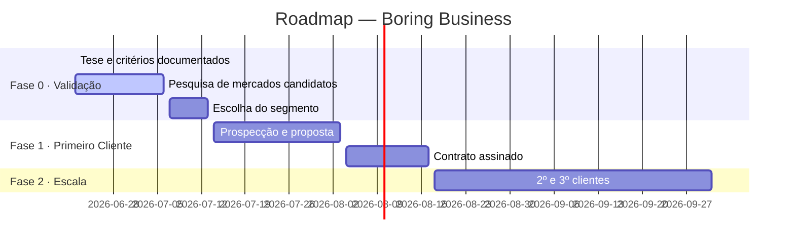

---
tags:
  - dashboard
cssclasses:
  - dashboard
created: 2026-06-22
updated: 2026-06-22
status: fase-0-validação
fase: "0 — Validação"
---

# Projeto Boring Business

> [!info] Status · Junho 2026
> **FASE 0 — Validação** · Próximo passo: escolher segmento de entrada e mapear 3–5 clientes potenciais reais em Matão/Ribeirão Preto

---

## 📊 Parâmetros do Projeto

> [!abstract] Restrições e Metas
>
> | Item | Valor |
> |------|-------|
> | Budget inicial | R$ 1.500 |
> | Meta mínima (Fase 1) | R$ 2.000/mês |
> | Meta de escala | R$ 10.000/mês |
> | Canal de aquisição | Consultivo / Orgânico |
> | Perfil do cliente | Empresa B2B |
> | Diferencial operacional | Automação interna via software próprio |

---

## ✅ Próximas Ações

> [!todo] Esta semana
> - [x] Pesquisar cada mercado candidato e pontuar pelos 7 critérios
> - [x] Mapear canais de distribuição e vantagens de entrada para os 4 mercados
> - [ ] Decidir segmento de entrada (SST confirmado como líder — técnico parceiro é o canal)
> - [ ] Contatar SINTESP interior SP + 3–5 técnicos SST freelancers via LinkedIn em Ribeirão Preto
> - [ ] Mapear 3–5 empresas em Matão/Ribeirão Preto que precisam de PGR+PCMSO

---

## 🗺️ Roadmap



---

## ❓ Questões em Aberto

> [!question] Confirmar SST como segmento de entrada e iniciar contato com técnicos parceiros?
> Pesquisa de canais confirma: técnico SST freelancer é o distribuidor mais eficiente — usuário do sistema + carteira de 10–50 clientes. Canal local: SINTESP interior SP, SESI RP, LinkedIn. Próximo passo: validar proposta de parceria com 3–5 técnicos reais antes de construir o sistema.

> [!question] Facilities como segundo eixo paralelo — vale a pena explorar junto com SST?
> ACIRP Ribeirão Preto tem Núcleo Setorial de Condomínios ativo (workshops anuais). Administradora com 30 prédios = 30 clientes em uma venda. Budget de patrocínio de palestra: R$500–1.500. Pode ser desenvolvido em paralelo sem custo de oportunidade significativo.

> [!question] Agronegócio como terceiro eixo ou descartado por ora?
> Urgência real (CMN 5.267/5.268 — bancos rejeitando crédito desde abril/2026), mas ciclo de adoção do agrônomo autônomo mais longo. AEAARP Ribeirão Preto é o canal de entrada. Janela: Coopercitrus Expo julho/2026. Recomendação: manter no radar para fase 2.

---

## ⚠️ Riscos

> [!danger] Risco Crítico — Habilitação técnica obrigatória para laudos
> PGR e PCMSO exigem assinatura de técnico de segurança ou médico do trabalho habilitado. O fundador não pode emitir laudos sem credencial. Mitigação: modelo de parceria onde o técnico assina e o fundador opera o sistema — testar se técnicos locais aceitam esse arranjo.

> [!warning] Riscos Médios
> - Ciclo de venda mais longo se o parceiro técnico não tiver carteira ativa de clientes
> - Precificação mal calibrada: cobrar barato demais para ser sustentável (referência: R$1.800–3.500/ano por empresa pequena)
> - Dependência do parceiro técnico: se sair, leva os clientes — formalizar contrato de não-concorrência

---

## 🗂️ Documentos do Projeto

### 🏛️ `council/` — [[council/CONSELHOS|Ver Índice Completo →]]

> [!note] Nenhuma sessão ainda
> Use `/new-council` para convocar o primeiro conselho quando um segmento estiver em análise.

### 🔬 `pesquisas/` — [[pesquisas/PESQUISAS|Pesquisas →]] · [[pesquisas/PRE-MORTEMS|Pré-Mortems →]] · [[pesquisas/STEELMANS|Steelmans →]]

> [!note] Última pesquisa
> [[pesquisas/dados/2026-06-22 — Canais de Distribuição e Vantagens de Entrada|2026-06-22 — Canais de Distribuição e Vantagens de Entrada]] · SST lidera no caminho para 5 clientes (técnico parceiro = usuário + distribuidor). Ranking: SST > Facilities > Agronegócio > Logística.

### 📝 `notas/` — [[notas/NOTAS|Notas Rápidas →]]

> [!note] Últimas entradas (2026-06-22)
> - [[notas/2026-06-22 — Hipótese Crítica SST|Hipótese Crítica SST]] · sem evidência de mercado ainda — validar dor específica antes de construir → pode virar `/research-note` ou `/new-plano`
> - [[notas/2026-06-22 — Validação de Dores Softwares SST|Validação de Dores Softwares SST]] · escopo da próxima pesquisa: SOC, ESO, Indexmed, Bevart, ProSESMT, RS Data → pode virar `/research-note`
> - [[notas/2026-06-22 — Quem Já Tem os Clientes|Quem Já Tem os Clientes?]] · mapeamento de distribuidores antes de escolher nicho → pode virar `/new-plano`

### 📋 `planos/` — [[planos/PLANOS|Ver Índice →]]

### 📁 `documentos/` — [[documentos/DOCUMENTOS|Ver Índice →]]

---

## 🏗️ Estrutura do Vault

```
vault/
├── HOME.md                    ← você está aqui
├── council/
│   └── CONSELHOS.md
├── pesquisas/
│   ├── PESQUISAS.md
│   ├── PRE-MORTEMS.md
│   └── STEELMANS.md
├── notas/
│   └── NOTAS.md
├── planos/
│   └── PLANOS.md
└── documentos/
    └── DOCUMENTOS.md
```

*Dashboard criado em 2026-06-22*
